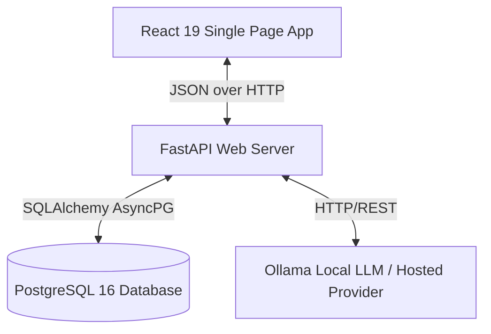
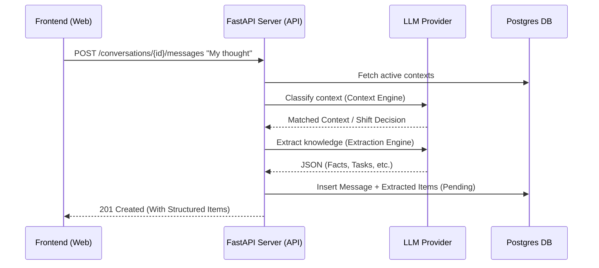

# AURA System Architecture

**Architecture Version:** 1.0  
**Compatible Milestone:** Sprint 5  
**Last Updated:** 2026-06-30  

Welcome to the AURA Architecture reference. This document serves as the canonical map for developers, detailing AURA's design patterns, module boundaries, data pipelines, and cognitive agent workflow.

---

## Revision History

| Version | Sprint | Date | Summary | Author |
| :--- | :--- | :--- | :--- | :--- |
| 1.0 | Sprint 5 | 2026-06-30 | Initial architecture, monorepo boundaries, dev fallback, and verification schemas | Antigravity & Harsha |

---

## 1. System Overview

AURA is a personal cognitive operating system designed to capture raw developer thoughts, structure them into actionable context, and assist in sprint planning and daily briefings.



---

## 2. Architecture Principles

AURA follows five core architectural principles:
- **Local-First Practicality:** Prioritize running models locally (via Ollama) and storing data locally to maintain privacy and offline productivity.
- **Human-in-the-Loop Review:** Never automate mutations to the knowledge base without explicit user consent. Present extraction chips for review.
- **Knowledge Over Chat History:** Focus on building a structured, clean semantic knowledge base rather than relying on endless, unstructured chat history.
- **Explicit Feedback Loops:** Submit reviews (Approve/Reject/Edit) back to the feedback model to constantly improve future extraction accuracy.
- **Modular AI Providers:** Keep LLM and context classification abstraction layers clean, allowing easy swapping of model providers.

---

## 3. Codebase Structure

AURA is structured as a monorepo:
- **`apps/web/`**: Single Page Application built on React 19, Vite, TailwindCSS, and Zustand.
- **`apps/api/`**: Asynchronous web server built on FastAPI and SQLAlchemy (PostgreSQL).
- **`scripts/`**: Development automation and screenshot generation utilities.
- **`docs/`**: Sprint specifications, APIs, database schemas, and developer roadmaps.

---

## 4. Frontend Architecture & State Ownership

The frontend is built to be fast, client-driven, and highly interactive:

### State Ownership Layering
To prevent duplication of business logic, state is owned explicitly across layers:

| Layer | Technology | Ownership Scope |
| :--- | :--- | :--- |
| **Presentation** | React 19 Components | Visual layout, localized UI toggles (e.g. edit input fields, reject reason states). |
| **Client State** | Zustand Store | Single source of client truth, API requests, session management, navigation routing. |
| **Business Rules** | FastAPI Routes | Validation, extraction triggers, context shifting logic, authorization. |
| **Persistent Truth** | PostgreSQL 16 | Relational tables, vectors, audits, and persisted developer memory. |

### Store-Driven State (`auraStore.ts`)
The Zustand store encapsulates client logic:
- Handles user authentication (development bypass fallback token).
- Manages the active conversation and fetches message timeline, briefings, and Explorer knowledge items.
- Encapsulates review actions (`approveKnowledgeItem`, `rejectKnowledgeItem`, `updateKnowledgeItem`) with object-based payloads.
- Decouples UI components from backend fetches.

---

## 5. Service & API Boundaries
AURA enforces clear service boundaries to keep the codebase maintainable:
```
React Component -> Zustand Store -> REST API -> Routers -> Services -> DB Persistence
```
- **UI Components** never invoke database operations directly.
- **UI Components** only interact with the REST API via Zustand store actions.
- **Services** own LLM orchestration and extraction rules; they do not handle HTTP formatting.

---

## 6. Security Layer
AURA protects user data using lightweight authentication checks:
```
Incoming HTTP Request -> Supabase JWT Bearer Middleware -> Dependency Guards -> Router Handler -> Database
```
- All routes (except login) require a valid Supabase JWT Bearer token in the `Authorization` header.
- The `get_current_user` dependency validates the token, automatically initializing the mock development user profile if the SUPABASE JWT secret is not configured.
- Row-level isolation ensures developers only query and mutate contexts/briefs belonging to their user ID.

---

## 7. Knowledge Processing Pipeline

The FastAPI server exposes REST endpoints to manage conversations and process incoming streams of developer thoughts.

### Cognitive Pipeline
When a user sends a message in a conversation:
1. **Context Engine Classifier:** Analyzes the raw thought against active contexts to associate the message or detect a context shift.
2. **Extraction Engine:** Calls the local Ollama LLM (`llama3`) or hosted API to parse out Facts, Decisions, Tasks, and Deadlines.
3. **Database Transaction:** Persists the message, assigns contexts, and inserts extracted items as `pending` review.



### Dev LLM Fallback Mode
To ensure the backend runs smoothly in environments where Ollama is not local or lacks model weights, `OllamaProvider` detects failures and falls back to a deterministic regex-based extractor and context matching tool.

---

## 8. Request & Knowledge Lifecycles

### Full Request Lifecycle
The path of a user thought message follows a strict lifecycle:
```
User Enters Thought -> React Submit -> Zustand Dispatch -> HTTP POST /messages -> Auth JWT Check -> Router -> Context Engine -> Extraction Engine -> DB Flush & Commit -> 201 Created -> Zustand State Update -> React Render
```

### Knowledge Item Lifecycle
A knowledge item evolves through four explicit review states:
```
Raw Message -> Extracted (Pending) -> User Action (Approve / Reject / Edit) -> Persistent Knowledge Base -> Executive Brief Compilation
```

---

## 9. Error Flow & Resilience
- **API Network Failures:** Handled inside Zustand actions. Catch blocks update the `error` state in the store.
- **LLM Provider Failures:** Caught inside the LLM provider. The backend falls back to deterministic extraction logic to prevent user request failures.
- **UI State Recovery:** Failed approvals or edits revert the local UI state and raise alerts or clean logs.

---

## 10. Future Agent Layer

As AURA matures, the cognitive layer will expand into a multi-agent cooperative architecture:
- **Planner Agent:** Formulates the strategy to analyze complex long-term thoughts.
- **Researcher Agent:** Gathers context from vector embeddings and external developer logs.
- **Knowledge Agent:** Governs the ingestion, deduplication, and lifecycle of knowledge cards.
- **Reviewer Agent:** Suggests updates or merges for conflicting items.
- **Executive Brief Agent:** Compiles the daily roadmap and tracks founder metrics.

---

## 11. Living Architecture

This document is the canonical architecture reference.

Any pull request that changes:
- Data flow or request lifecycle
- API contracts or service boundaries
- Database schema or state ownership models
- AI providers or knowledge models

must update this document as part of the same PR.
